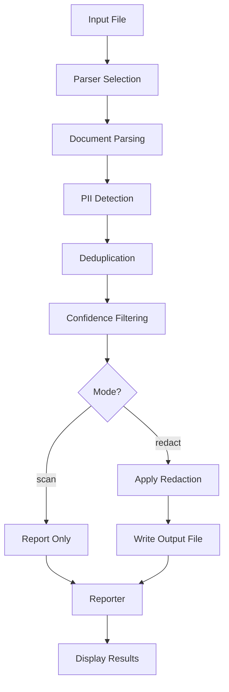
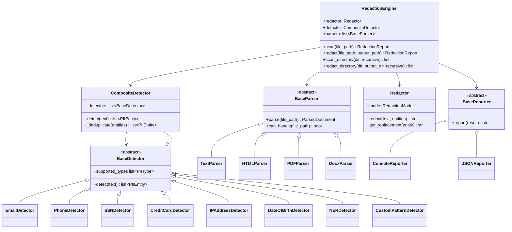

# Redactify Pipeline Architecture

Visual guide to how data flows through Redactify from input to output.

---

## High-Level Flow



---

## Detailed Pipeline

```
┌─────────────────────────────────────────────────────────────────────────┐
│                              CLI ENTRY                                   │
│                                                                         │
│   redactify redact document.pdf -o redacted.pdf --mode label            │
│   redactify scan document.txt --confidence 0.8                          │
│                                                                         │
└──────────────────────────────────┬──────────────────────────────────────┘
                                   │
                                   ▼
┌─────────────────────────────────────────────────────────────────────────┐
│                         REDACTION ENGINE                                 │
│                                                                         │
│   RedactionEngine(mode, detect_types, use_ner, custom_patterns,         │
│                   confidence_threshold)                                  │
│                                                                         │
│   Orchestrates: Parser → Detector → Filter → Redactor → Reporter       │
└──────────────────────────────────┬──────────────────────────────────────┘
                                   │
                  ┌────────────────┼────────────────┐
                  ▼                                  ▼
┌─────────────────────────────┐    ┌─────────────────────────────────────┐
│     1. PARSER SELECTION     │    │     BATCH MODE (directories)        │
│                             │    │                                     │
│  .txt .csv .log .md .text   │    │  engine.redact_directory(           │
│       → TextParser          │    │      input_dir, output_dir,         │
│                             │    │      recursive=True                 │
│  .html .htm                 │    │  )                                  │
│       → HTMLParser          │    │                                     │
│                             │    │  Iterates all supported files       │
│  .pdf                       │    │  and runs pipeline on each          │
│       → PDFParser           │    └─────────────────────────────────────┘
│                             │
│  .docx                      │
│       → DocxParser          │
│                             │
│  (other)                    │
│       → UnsupportedError    │
└──────────────┬──────────────┘
               │
               ▼
┌─────────────────────────────────────────────────────────────────────────┐
│                        2. DOCUMENT PARSING                               │
│                                                                         │
│   parser.parse(file_path) → ParsedDocument                              │
│                                                                         │
│   ┌─────────────────────────────────────────────────────────┐           │
│   │  ParsedDocument                                         │           │
│   │  ├── source_path: Path                                  │           │
│   │  ├── file_type: str                                     │           │
│   │  └── chunks: list[DocumentChunk]                        │           │
│   │       ├── chunk.text: str         (content)             │           │
│   │       ├── chunk.page: int | None  (for PDFs)            │           │
│   │       └── chunk.metadata: dict                          │           │
│   └─────────────────────────────────────────────────────────┘           │
│                                                                         │
│   TextParser  → 1 chunk (entire file content)                           │
│   HTMLParser  → 1 chunk (tags stripped, whitespace normalized)           │
│   PDFParser   → N chunks (1 per page)                                   │
│   DocxParser  → 1 chunk (all paragraphs joined)                         │
└──────────────────────────────────┬──────────────────────────────────────┘
                                   │
                                   ▼
┌─────────────────────────────────────────────────────────────────────────┐
│                        3. PII DETECTION                                  │
│                                                                         │
│   For each chunk:                                                       │
│       composite_detector.detect(chunk.text) → list[PIIEntity]           │
│                                                                         │
│   ┌─────────────────────────────────────────────────────────────────┐   │
│   │                    CompositeDetector                             │   │
│   │                                                                 │   │
│   │   Runs ALL detectors in parallel, merges results:               │   │
│   │                                                                 │   │
│   │   ┌─────────────────┐  ┌────────────────┐  ┌───────────────┐   │   │
│   │   │  Regex Detectors│  │  NER Detector  │  │Custom Patterns│   │   │
│   │   │                 │  │                │  │               │   │   │
│   │   │  • Email        │  │  spaCy model   │  │  User-defined │   │   │
│   │   │  • Phone        │  │  (lazy-loaded) │  │  regex rules  │   │   │
│   │   │  • SSN          │  │                │  │               │   │   │
│   │   │  • Credit Card  │  │  Maps labels:  │  │  From config  │   │   │
│   │   │  • IP Address   │  │  PERSON → 0.85 │  │  or API args  │   │   │
│   │   │  • Date of Birth│  │  ORG    → 0.85 │  │               │   │   │
│   │   │                 │  │  GPE/LOC→ 0.85 │  │  conf = 1.0   │   │   │
│   │   │  conf = 1.0     │  │                │  │               │   │   │
│   │   │  (DOB = 0.5-0.9)│  │                │  │               │   │   │
│   │   └────────┬────────┘  └───────┬────────┘  └───────┬───────┘   │   │
│   │            │                    │                    │           │   │
│   │            └────────────────────┼────────────────────┘           │   │
│   │                                 ▼                                │   │
│   │                    ┌─────────────────────────┐                   │   │
│   │                    │    DEDUPLICATION         │                   │   │
│   │                    │                         │                   │   │
│   │                    │  1. Sort by position    │                   │   │
│   │                    │  2. Check overlaps      │                   │   │
│   │                    │  3. Keep highest conf   │                   │   │
│   │                    │  4. Remove duplicates   │                   │   │
│   │                    └─────────────────────────┘                   │   │
│   └─────────────────────────────────────────────────────────────────┘   │
│                                                                         │
│   Output per entity:                                                    │
│   ┌─────────────────────────────────────────────────────────┐           │
│   │  PIIEntity(frozen dataclass)                            │           │
│   │  ├── text: str           "john@example.com"             │           │
│   │  ├── pii_type: PIIType   PIIType.EMAIL                  │           │
│   │  ├── start: int          45                             │           │
│   │  ├── end: int            62                             │           │
│   │  └── confidence: float   1.0                            │           │
│   └─────────────────────────────────────────────────────────┘           │
└──────────────────────────────────┬──────────────────────────────────────┘
                                   │
                                   ▼
┌─────────────────────────────────────────────────────────────────────────┐
│                      4. CONFIDENCE FILTERING                             │
│                                                                         │
│   if confidence_threshold > 0:                                          │
│       entities = filter_by_confidence(entities, threshold)              │
│                                                                         │
│   Example: --confidence 0.8                                             │
│       ✓ Email (1.0)         → kept                                      │
│       ✓ Person/NER (0.85)   → kept                                      │
│       ✗ DOB no context (0.5)→ removed                                   │
│                                                                         │
│   Also available (via API):                                             │
│       filter_by_type(entities, [PIIType.EMAIL, PIIType.PHONE])          │
│       filter_by_min_length(entities, min_length=3)                      │
└──────────────────────────────────┬──────────────────────────────────────┘
                                   │
                          ┌────────┴────────┐
                          │                 │
                    scan mode          redact mode
                          │                 │
                          ▼                 ▼
┌──────────────────────────────┐  ┌───────────────────────────────────────┐
│    5a. SCAN (report only)    │  │         5b. REDACTION                  │
│                              │  │                                       │
│  No file modification.       │  │  redactor.redact(text, entities)      │
│  Entities collected for      │  │                                       │
│  reporting.                  │  │  Algorithm (reverse-order):            │
│                              │  │                                       │
│                              │  │  1. Sort entities by start DESC       │
│                              │  │  2. For each (from end to start):     │
│                              │  │     text = text[:start]               │
│                              │  │           + replacement               │
│                              │  │           + text[end:]                │
│                              │  │  3. Return fully redacted text        │
│                              │  │                                       │
│                              │  │  ┌─────────────────────────────────┐  │
│                              │  │  │ Replacement Modes:              │  │
│                              │  │  │                                 │  │
│                              │  │  │ BLACKOUT → ████████████████     │  │
│                              │  │  │            (matches length)     │  │
│                              │  │  │                                 │  │
│                              │  │  │ LABEL   → [EMAIL]              │  │
│                              │  │  │            [PERSON]            │  │
│                              │  │  │            [PHONE]             │  │
│                              │  │  │                                 │  │
│                              │  │  │ HASH    → [REDACTED-a1b2c3d4]  │  │
│                              │  │  │            (deterministic       │  │
│                              │  │  │             SHA-256 prefix)     │  │
│                              │  │  │                                 │  │
│                              │  │  │ CUSTOM  → user-provided string │  │
│                              │  │  └─────────────────────────────────┘  │
│                              │  │                                       │
└──────────────┬───────────────┘  └───────────────────┬───────────────────┘
               │                                      │
               │                                      ▼
               │                  ┌───────────────────────────────────────┐
               │                  │       6. WRITE OUTPUT                  │
               │                  │                                       │
               │                  │  output_path.write_text(              │
               │                  │      '\n'.join(redacted_chunks)       │
               │                  │  )                                    │
               │                  │                                       │
               │                  │  Default output name:                 │
               │                  │    {stem}.redacted{suffix}            │
               │                  │    e.g. report.redacted.pdf           │
               │                  └───────────────────┬───────────────────┘
               │                                      │
               └──────────────────┬───────────────────┘
                                  │
                                  ▼
┌─────────────────────────────────────────────────────────────────────────┐
│                         7. REPORTING                                     │
│                                                                         │
│   Build RedactionReport:                                                │
│   ┌─────────────────────────────────────────────────────────┐           │
│   │  RedactionReport                                        │           │
│   │  ├── source_file: Path                                  │           │
│   │  ├── total_entities: int                                │           │
│   │  ├── entities_by_type: {"email": 3, "phone": 1, ...}   │           │
│   │  ├── entities: list[PIIEntity]                          │           │
│   │  └── redacted: bool                                     │           │
│   └─────────────────────────────────────────────────────────┘           │
│                                                                         │
│   Reporter formats:                                                     │
│                                                                         │
│   ┌─────────────────────────┐       ┌───────────────────────────────┐   │
│   │ ConsoleReporter         │       │ JSONReporter                  │   │
│   │                         │       │                               │   │
│   │ ========================│       │ {                             │   │
│   │   Redactify Report      │       │   "source_file": "doc.txt",  │   │
│   │ ========================│       │   "total_entities": 5,        │   │
│   │   File:     doc.txt     │       │   "entities_by_type": {...},  │   │
│   │   Total PII: 5         │       │   "entities": [...]           │   │
│   │                         │       │ }                             │   │
│   │   email    3            │       │                               │   │
│   │   phone    2            │       │                               │   │
│   └─────────────────────────┘       └───────────────────────────────┘   │
└─────────────────────────────────────────────────────────────────────────┘
```

---

## Component Relationships



---

## Key Algorithms

### Reverse-Order Redaction

Why replace from end to start? Because replacing text shifts character indices.

```
Original: "Email john@test.com and phone (555) 123-4567"
                 ^-----------^          ^--------------^
                 start=6 end=19         start=30 end=44

If we replace left-to-right:
  Step 1: "Email [EMAIL] and phone (555) 123-4567"
           Now "phone" starts at position 20, not 30!

If we replace right-to-left:
  Step 1: "Email john@test.com and phone [PHONE]"
           "john@test.com" position unchanged at 6-19
  Step 2: "Email [EMAIL] and phone [PHONE]"
           Correct!
```

### Overlap Deduplication

When regex and NER detect the same text:

```
Input: "Contact John Smith at john@acme.com"

Regex detects:  PIIEntity("john@acme.com", EMAIL, 22, 36, conf=1.0)
NER detects:    PIIEntity("John Smith", PERSON, 8, 18, conf=0.85)
NER detects:    PIIEntity("john", PERSON, 22, 26, conf=0.85)  ← overlaps EMAIL!

Deduplication:
  "john" (conf 0.85) overlaps "john@acme.com" (conf 1.0)
  → Keep "john@acme.com" (higher confidence)

Final: [PIIEntity(PERSON, 8-18), PIIEntity(EMAIL, 22-36)]
```

### Context-Aware Detection (Date of Birth)

```
Input: "Born on 03/15/1990. Meeting on 03/15/2024."

Date regex matches both. Context check (±50 chars):
  "Born on 03/15/1990" → keyword "born" found → confidence 0.9
  "Meeting on 03/15/2024" → no birth keywords → confidence 0.5

With --confidence 0.8:
  ✓ First date kept (0.9 ≥ 0.8)
  ✗ Second date filtered out (0.5 < 0.8)
```

---

## Design Patterns

| Pattern | Where | Purpose |
|---------|-------|---------|
| Strategy | `RedactionMode` + `Redactor` | Swap redaction algorithms |
| Composite | `CompositeDetector` wrapping N detectors | Combine detection methods |
| Template Method | `BaseParser.parse()` / `BaseDetector.detect()` | Pluggable implementations |
| Factory | `_build_parsers()` / `_build_detector()` | Handle optional dependencies |
| Lazy Loading | `NERDetector._load_model()` | Defer expensive spaCy init |
| Immutable Value | `@dataclass(frozen=True)` on `PIIEntity` | Safe sharing across pipeline |
